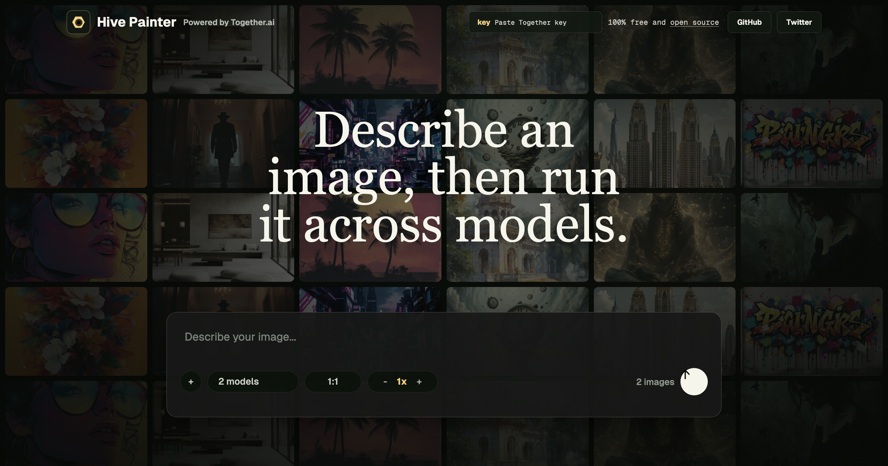

<a href="https://github.com/CPJ-N/hive-painter">
  
  <h1 align="center">Hive Painter</h1>
</a>

  A multi-model AI image workspace for running one prompt across Together AI's image model fleet, comparing outputs, and keeping every generation in view.

## Features

- Multi-model selection from Together AI's image model fleet
- Smart variation defaults for model comparison and solo generation
- Floating composer with persistent generation history
- Concurrent generation with progressive grid results separated by run
- Aspect ratio selection (1:1, 16:9, 9:16, 4:3, 3:4)
- Server-side API key support with optional user API key entry in the navbar

## Tech stack

- [Together AI](https://together.ai) for image model inference
- Next.js App Router with Tailwind CSS
- React Query for model list caching
- Optional Helicone observability
- Optional Plausible analytics

## Setup

1. Clone the repo: `git clone https://github.com/CPJ-N/hive-painter`
2. Copy `.example.env` to `.env.local` and add your [Together AI API key](https://api.together.xyz/settings/api-keys): `TOGETHER_API_KEY=`
3. Run `pnpm install` and `pnpm dev`

## Environment variables

| Variable                   | Required | Description                                                                                             |
| -------------------------- | -------- | ------------------------------------------------------------------------------------------------------- |
| `TOGETHER_API_KEY`         | No       | Server-side Together AI API key for image generation. Users can also enter their own key in the navbar. |
| `HELICONE_API_KEY`         | No       | Helicone observability                                                                                  |
| `ENABLE_RATE_LIMIT`        | No       | Set to `true` to enable Upstash rate limiting (off by default)                                          |
| `UPSTASH_REDIS_REST_URL`   | No       | Required only if rate limiting is enabled                                                               |
| `UPSTASH_REDIS_REST_TOKEN` | No       | Required only if rate limiting is enabled                                                               |

## Usage

1. Type a prompt in the floating composer
2. Select one or more image models
3. Set the variation count, or keep the smart default
4. Click **Run** or press `Cmd+Enter`

Images appear in grouped result runs as each model completes.
